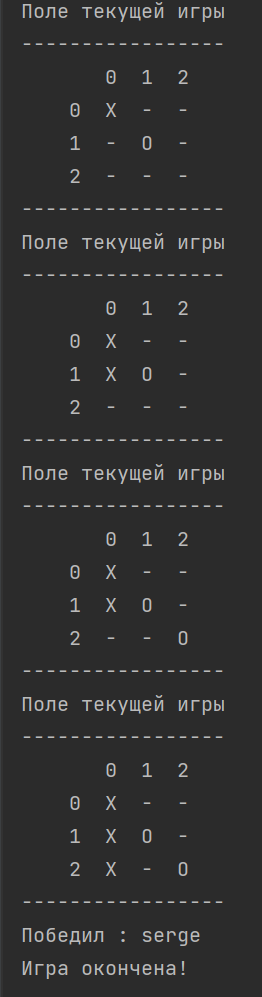

# Getting Started
## Задание №3*

Реализовано посредством Spring Boot и Spring Web Starter.

Загрузка файла осуществляется через форму по адресу

    localhost:8080

После загрузки файла выводится сообщение, что файл загружен.

    You successfully uploaded %filename%

Игра воспроизводится в консоли на стороне сервера в отдельном потоке.

