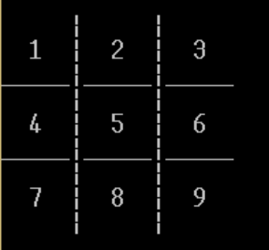

# Getting Started YLAB

## Задания предыдущих уроков

- [lesson 4 README](LESSON4_README.MD)

## Задание урока 5

Адрес корневого ресурса:

    localhost:8080/gameplay

Ходы производятся посредством отправки запроса методом `POST` по адресу:

    localhost:8080/gameplay/move

В теле запроса ожидается JSON следующего вида:

```json
    {
        "cellNumber": 1,
        "playerId": 1
    }
```

Ключ `"cellNumber"` принимает значения типа `number` в диапазоне
от 1 до 9 включительно, согласно цифровому обозначению полей игрового
поля (numpad)



Ключ `playerId` принимает значения типа `number` `1` или
`2` соотвественно по номерам игроков. Игру всегда начинает игрок `1`.
Игроки ходят по очереди.

Входящие значения ключей валидируются, в случае несоответсвия указанным
ограничениям приходит ответный JSON следующего формата с указанием ошибки:
```json
{
	"message": "cell number must be from 1 to 9",
	"localDate": "2022-03-27T01:24:25"
}
```

При успешном выполнении хода в ответ получаем JSON данного рода:

```json
{
	"board": [
		"-",
		"X",
		"-",
		"-",
		"-",
		"-",
		"O",
		"-",
		"-"
	],
	"playerNextMoveId": 1,
	"winnerId": null,
	"draw": false
}
```
Поля имеют следюющий смысл:

- `board` - состояние игрового поля после хода;
- `playerNextMoveId` - id игрока, который должен сделать следующий ход;
- `winnerId` - id игрока-победителя, если таковой определился после хода;
- `draw` - поле типа `boolean` с указанием установилась ли ничья
после совершенного хода;

После завершения игры ничьей или выигрышем, последующие ходы не принимаются,
и в ответ приходит JSON с указанием причины.

Для того, чтобы начать новую игру, необходимо отправить запрос 
методом `GET` по адресу:
    
    localhost:8080/gameplay/new

И уже затем вновь переходить к ходам. 

    localhost:8080/gameplay/move