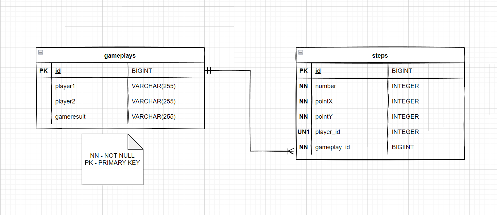

# Getting Started YLAB

## Задания предыдущих уроков

- [lesson 4 README](previous-readme/LESSON4_README.MD)
- [lesson 5 README](previous-readme/lesson5_1.1_readme.md)


---

## Задание урока 6

Адрес корневого ресурса сервера:

    localhost:8080/gameplay

Запуск Front части осуществляется из папки `frontend-tic-tac-toe`

```bash
npm install
````
 и
```bash
npm start
````

### Подключение к базе данных

Используется база данных `H2`, вариант `in memory`.

Параметры:

- имя базы данных: `ylabhomework`;
- **без** пользователя и пароля;
```
url: jdbc:h2:mem:ylabhomework
```
Полный список параметров находится в файле настроек 
`application.properties`.

---

### Работа с базой данных

Схема таблиц и взаимоотношений в базе имеет следующую схематичную
структуру:



После завершения игры в базу данных сохраняется уже знакомый нам 
по предыдущим заданиям объект `Gameplay`, его несколько измененная форма.

Функционал реализован на базе Spring Boot и Spring Data JPA Starter, 
через ORM Hibernate.
---

### REST API

Добавился некоторый функционал:

- endpoint возвращает объект `Gamplay` в JSON представлении
только последней сыгранной игры
```
    localhost:8080/gameplay/result/last
```
- endpoint возвращает массив объектов Gameplay всех игр:
```
    localhost:8080/gameplay/result
```